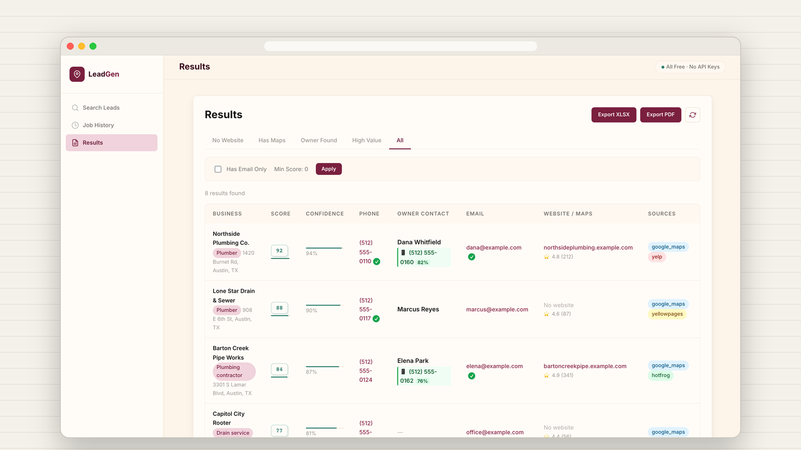
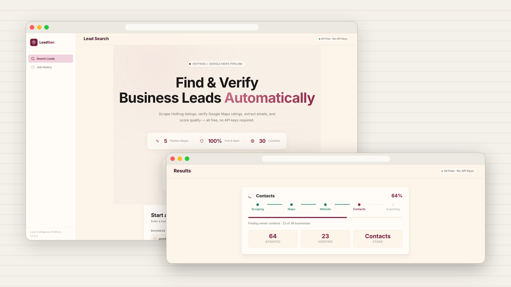

<p align="center">
  
</p>

# LeadGen

**Find local businesses, verify what you found, and hand back a scored lead list.**

You type a niche and a place, like *plumbers in Austin, TX*. LeadGen searches several public directories, merges what it finds into unique businesses, checks each one (Maps rating, website, owner and contact details), scores them, and exports a clean Excel sheet and PDF report. It runs on your own machine, and the core pipeline needs no paid APIs.

<br>

## What it does

- **Searches several sources at once.** Google Maps, Yelp, Yellow Pages, Hotfrog and the NPI registry for healthcare, merged and de-duplicated by phone and name.
- **Enriches every business.** Maps rating and review count, website health (live, SSL, CMS), owner name and title, emails, phones and socials.
- **Prefers verified over found.** Each field carries a verification flag, and unverified data counts for less in the score. A phone that matches across sources beats one scraped once.
- **Shows its work live.** Progress streams to the UI over WebSockets, stage by stage.
- **Exports what a sales team uses.** An XLSX sheet, a PDF report, and optional one-page research dossiers per lead.
- **Goes deeper when you ask.** Optional LLM pitch research (free NVIDIA NIM tier or a local Ollama model), legal-entity lookup, worst-first review harvesting, and a call queue with disposition tracking.

<p align="center">
  
</p>

## How it works

```
niche + location
   │
   ▼
1. Discover ────► Google Maps · Yelp · Yellow Pages · Hotfrog · NPI   → merged, de-duplicated
2. Maps ────────► rating, reviews, hours, open status
3. Website ─────► live? SSL? CMS? marketing stack
4. Contacts ────► owner name and title, verified emails, phones, socials
5. Score ───────► weighted lead score + per-field verification flags
6. Export ──────► leads.xlsx · leads_report.pdf · (optional) per-lead dossiers
```

A FastAPI server takes the search, a Celery worker runs the pipeline with Playwright, and the Next.js app follows along over a WebSocket.

## Quick start

You need Python 3.11+, Node 18+ and Docker (for Redis).

```bash
# Backend
uv sync                                   # or: pip install -e .
python -m playwright install chromium
cp .env.example .env
docker compose up -d redis

uvicorn backend.main:app --reload --port 8000                                # terminal 1
celery -A backend.workers.celery_app worker --loglevel=info --concurrency=2  # terminal 2

# Frontend
cd frontend && cp .env.example .env.local && npm install && npm run dev    # terminal 3
```

Open http://localhost:3000, enter a niche and a location, and press search.

To run the backend in Docker instead: `docker compose up --build` starts Redis, Tor, the API and a worker.

## Configuration

Everything lives in `.env`; [`.env.example`](.env.example) documents each setting. The defaults work for local use.

| Setting | Default | What it does |
| :-- | :-- | :-- |
| `SCRAPER_HEADLESS` | `true` | Run browsers invisibly. Set `false` to watch a scraper while debugging. |
| `MAPS_REQUEST_DELAY_MIN/MAX` | `2.0` / `4.0` | Polite delay between Maps requests, in seconds. |
| `TOR_SOCKS_PORTS` | `9050,…` | Optional Tor daemons for spreading requests across exit IPs. |
| `ENABLE_PITCH_RESEARCH` | `false` | Per-lead pitch research with an LLM. Needs `NVIDIA_API_KEY` (free) or a local Ollama model. |
| `ENABLE_REGISTRATION_LOOKUP` | `false` | Legal-entity lookup via SAM.gov (free key) and OpenCorporates. |

## Tests

```bash
pytest                       # backend: 130 tests, no network or keys needed
cd frontend && npm test      # frontend: Vitest + Testing Library
```

## Project layout

```
backend/
  api/        FastAPI routes: jobs, leads, health, websocket
  services/   scrapers, enrichment, scoring, LLM research, XLSX and PDF builders
  workers/    the Celery pipeline
  utils/      validation, retry, naming, logging
hotfrog/      Hotfrog scraper (also usable on its own, with an MCP server)
frontend/     Next.js app
scripts/      Tor daemon helpers, end-to-end lifecycle test, dossier builder
tests/        pytest suite
docs/         architecture, data sources, audits and design notes
```

Start with [`docs/architecture.md`](docs/architecture.md) for the full map: every process, stage and module, and the traps found along the way.

## Use it responsibly

LeadGen collects business information that is publicly listed. How you use it is up to you, and so is the responsibility:

- Respect each site’s terms of service and keep the request delays on.
- Follow the laws where you and your leads are, such as CAN-SPAM and TCPA in the US, or GDPR in the EU, before you email or call anyone.
- Don’t resell or publish personal contact details you collect.

## License

[MIT](LICENSE) © Muhammad Adam
