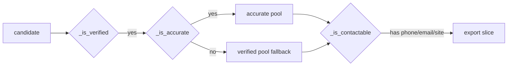

# Accuracy and Verification

> [!info] How a candidate becomes a trustworthy delivered lead
> Parent: [[Scraper System]] · Gates live in [[Pipeline Integration]]

Accuracy is enforced at two layers: **at the source** (never attach wrong data) and **at the gates** (never deliver unverified data). The whole design biases toward *missing over wrong*.

## Layer 1 — accuracy at the source

- [[Google Maps Enrichment|Name-match gate]]: a Maps result that doesn't fuzzy-match returns `_EMPTY`, not a different business's rating.
- [[Maps Extraction Internals|Panel scoping + `data-item-id`]]: reads survive class churn and never bleed a neighbour's data.
- [[Sources Orchestrator|Cross-source corroboration]]: `phone_source_count` records how many independent sources agree on the phone.

## Layer 2 — the three gates

| Gate | Line | Rule |
|------|------|------|
| `_is_verified` | :67 | score ≥ `VERIFY_MIN_SCORE` **or** phone+Maps **or** NPI+phone |
| `_is_accurate` | :89 | confidence ≥ `MIN_EXPORT_CONFIDENCE` **and** (verified channel **or** Maps + ≥2 sources) |
| `_is_contactable` | :84 | has at least one of phone / owner-email / website |

> [!important] Never deliver nothing
> Each gate has an empty-set fallback: if the strict filter would empty the order, it falls back to the looser pool. Quality-first, but a job never returns an empty file.

## Verification tiers (honest labels)

`_stage_score` (:542) stamps each lead:
- **verified** — an independently-checked channel (phone valid via libphonenumber, or email RCPT/MX).
- **corroborated** — no verified channel, but on Maps AND ≥2 sources.
- **unverified** — neither; ships only via the never-empty fallback.

## `data_confidence` (0-1)

A weighted sum over verified phone/email, active website, Maps presence, owner name, multi-source agreement, address validity, and deep-research fields. Drives `_is_accurate` and the export ranking.

> [!note] The behavior shift from the enrichment fix
> Marking `has_google_maps=True` for any name-matched place (even zero-review) makes more phone+Maps businesses count as **verified**. That's correct — a real business on Maps with a valid phone is a real lead → [[Google Maps Enrichment#Behavior change worth knowing]].

#scraper/concept #scraper/accuracy
