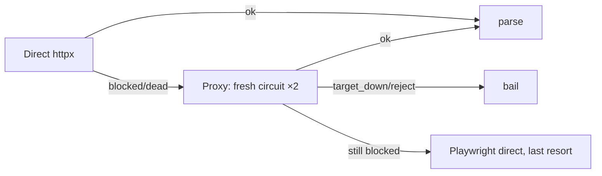

# Directory Scrapers — Yelp & YellowPages

> [!info] Supplementary sources, gated off by default
> Parent: [[Scraper System]] · Role: [[Discovery vs Enrichment|discovery]] · Retry model: [[Failure Classification and Retry]]

Near-identical httpx scrapers. Clean code — the reason they're **off** (`ENABLED_SOURCES`) is structural, not a bug: they yield ~0 over Tor because directories blocklist Tor exits and PerimeterX/Cloudflare block the direct IP.

## The fetch ladder (both)

- **Direct-first** (`_fetch` — yelp `:70`, yp `:66`): the clean host IP is least blocked; Tor is the fallback, not the default → [[Proxy Strategy Tiers#Direct-first is deliberate]].
- **Classify then retry** (`_classify` — yelp `:57`, yp `:53`): a block burns the exit IP → retry on a **fresh** [[get_proxy and Tags|circuit]]; a 5xx/404 is the target's problem → don't bother rotating.
- `TIMEOUT = 4s` — deliberately brutal (yelp `:25`, yp `:21`): fail fast rather than hang a browser-per-fetch over slow Tor.

## Parsing

| Source | Strategy | Line |
|--------|----------|------|
| Yelp | JSON-LD first (`itemListElement`), then cards | `_parse_jsonld` :158 |
| YellowPages | BeautifulSoup result cards | `_parse` :141 |

> [!note] YP's block is an interstitial, not a 403
> `yellowpages._classify` treats a **thin body on an OK status** (`len(text) <= 2000`) as a block worth retrying — YP serves a short interstitial rather than a hard 4xx. Yelp keys off captcha/PerimeterX markers via `_is_blocked` (:117).

## Why keep them if they're off?

They're the **future home of the residential-proxy tier** → [[Proxy Strategy Tiers]]. Populate `EXTERNAL_SOCKS_PROXIES` and these route through real IPs that directories don't blocklist. Correct today, cheap when off, one config flag from useful.

#scraper/concept #scraper/directories
