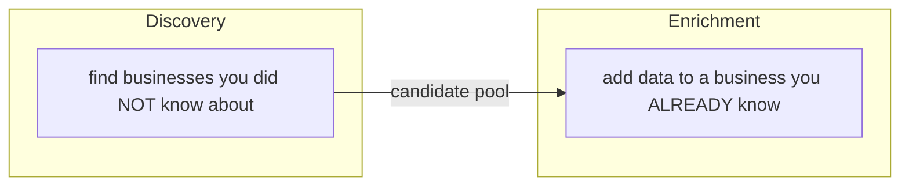

# Discovery vs Enrichment

> [!info] The root distinction
> Parent: [[Scraper System]] · Every scraper module is one of these two.

Two verbs, two cost profiles, two failure modes. Keeping them separate is why one blocked source can't sink a job.

## Discovery — "who is out there?"

Input: a niche + location. Output: many candidate businesses. Runs **once per job** across [[Sources Orchestrator|tiled query variants]] and merges everything into a unique pool.

- **Google Maps search** — primary, richest ([[Google Maps Discovery]]).
- **NPI** — official US healthcare registry (API, high-volume, carries medical niches).
- **Hotfrog / YellowPages / Yelp** — supplementary coverage ([[Directory Scrapers]], [[Hotfrog]]).

## Enrichment — "tell me more about THIS one"

Input: a known business (name + city, or a Maps URL). Output: extra fields on it. Runs **per-lead, best-first, in batches** until the verified target is met ([[Pipeline Integration#Enrich until target]]).

- **Google Maps rating** — confirm + attach rating/reviews/open ([[Google Maps Enrichment]]).
- **Reviews** — real review content, worst-first ([[Review Scraper]]).
- **Website / contacts / intel / registration** — crawl the lead's own site + registries.

## Why the split matters

| | Discovery | Enrichment |
|--|--|--|
| Runs | once per job | per candidate, until N verified |
| Cost driver | breadth (tiles × pages) | depth (per-lead browser work) |
| A failure means | fewer candidates | one lead missing a field |
| Isolation | one source `try/except` in [[Sources Orchestrator]] | one lead `try/except` in [[Pipeline Integration]] |

> [!tip] The two Google Maps modules
> `google_maps_search.py` (discovery) and `google_maps_scraper.py` (enrichment) are **not duplicates** — they answer different questions. But enrichment now *delegates its extraction* to discovery's reader so there's exactly one place that knows how to read a Maps panel correctly → [[Maps Extraction Internals]].

#scraper/concept
