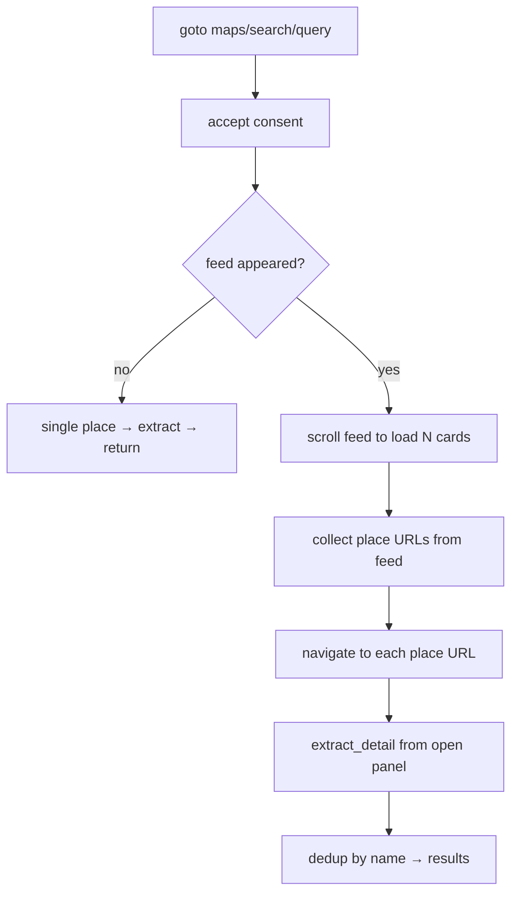

# Google Maps Discovery

> [!info] The primary source — volume AND depth
> Parent: [[Scraper System]] · Role: [[Discovery vs Enrichment|discovery]] · Reader: [[Maps Extraction Internals]]

`search_maps_businesses()` (`google_maps_search.py:372`) *discovers* businesses: it searches Maps, scrolls the feed to load many listings, then opens each place's detail panel for the richest per-business record.

## The flow

## What each stage buys

| Stage | Function | Why it's built this way |
|-------|----------|-------------------------|
| Scroll | `_scroll_feed` :290 | Maps lazy-loads ~20 cards and only fetches more when the **last card** scrolls into view. `wait_for_function` on card-count growth beats blind sleeps — this is the fix for the old ~22-result ceiling. |
| Count | `_count_cards` :357 | Counts `a.hfpxzc` (the real place links) — the same thing the harvest collects, so scroll and collect never disagree. |
| Collect | in `search_maps_businesses` :454 | Gathers canonical `/maps/place/` URLs **up front**, then navigates each — see [[Maps Extraction Internals#Navigate not click]]. |
| Extract | `_extract_detail` :232 | The shared panel-scoped reader → [[Maps Extraction Internals]]. |
| Dedup | :493 | By lowercased name; Maps re-serves places across scroll rounds. |

## Fields harvested

name · category · address · phone · website · plus_code · hours · price_level · description (editorial) · google_rating · google_review_count · google_is_open · google_maps_url · lat/lng.

These map onto `LEAD_FIELDS` in [[Sources Orchestrator]].

## Proxy posture

Launches with a single launch-time circuit (`get_proxy(for_playwright=True)`, untagged → round-robin). Tiles spread across [[Tor Proxy System|Tor]] ports because [[Sources Orchestrator|tiling]] runs several searches concurrently, each grabbing the next port.

> [!note] One circuit per tile
> Within a tile, all ~60 place navigations ride **one** exit IP, sequentially and paced. That's fine for discovery (unlike enrichment, which needs [[Circuit Capacity and Concurrency|per-context circuits]] because it fans out concurrently).

#scraper/concept #scraper/google-maps
