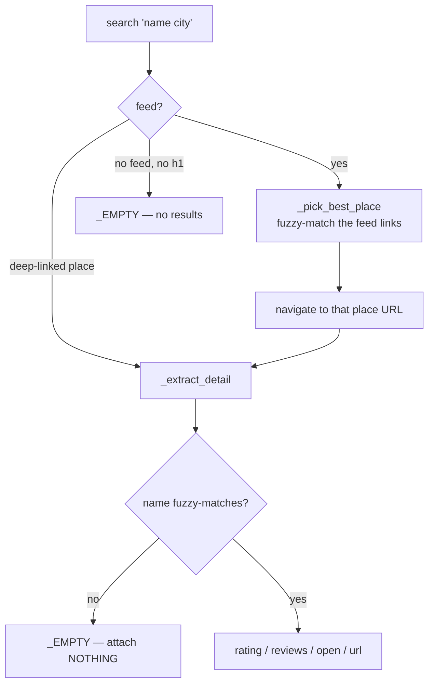

# Google Maps Enrichment

> [!info] Confirm a known business, attach its rating
> Parent: [[Scraper System]] · Role: [[Discovery vs Enrichment|enrichment]] · Reader: [[Maps Extraction Internals]]

Given a business discovered elsewhere (YellowPages/Yelp/Hotfrog), `scrape_single_lead()` (`google_maps_scraper.py:145`) confirms it on Maps and attaches rating / review_count / open-status. This file is now **thin on purpose** — it lands on the right page and hands off to [[Maps Extraction Internals|`_extract_detail`]].

## The flow (and its accuracy gates)

> [!danger] Attach nothing over attaching wrong
> A name mismatch returns `_EMPTY`, never a different business's numbers. **Silently-wrong data is worse than missing data** — it flows straight into [[Accuracy and Verification|scoring]]. This gate (`:198`) is the whole point of the rewrite.

## Key pieces

| Piece | Line | Role |
|-------|------|------|
| `_pick_best_place` | :81 | **pure** — rank feed links by name, pick best (≥0.4) else first. Unit-tested. |
| `_best_match_href` | :105 | collect `(href, aria)` from the feed, call `_pick_best_place` |
| `_fuzzy_match_names` | :54 | rapidfuzz token/partial/set max; the final correctness gate |
| `scrape_maps_ratings_batch` | :213 | the concurrent, per-circuit batch runner (below) |

## Concurrency = per-context Tor circuits

The batch runs **N browser contexts** over a shared queue, each with its **own exit IP** (`tag=f"maps{w}"`), so Google throttles per-IP not globally. `n_ctx` is capped by [[Circuit Capacity and Concurrency|`circuit_capacity()`]] so contexts never stack onto one IP.

> [!note] Chromium needs the launch sentinel
> Chromium honours a per-context proxy only if the browser was launched with one, so it launches with `{"server": "per-context"}` and each context sets its real circuit. Why Chromium can't just use SOCKS-auth like httpx → [[Circuit Isolation]].

## Behavior change worth knowing

`has_google_maps` is now `True` whenever a **name-matched place page** loads — previously it required a rating or review to exist. A business on Maps with zero reviews *is* on Maps, so this is more accurate. Because [[Accuracy and Verification|`_is_verified`]] counts `phone_verified AND has_google_maps`, **verified counts may tick up slightly** — a correctness gain, not inflation.

#scraper/concept #scraper/google-maps #scraper/accuracy
