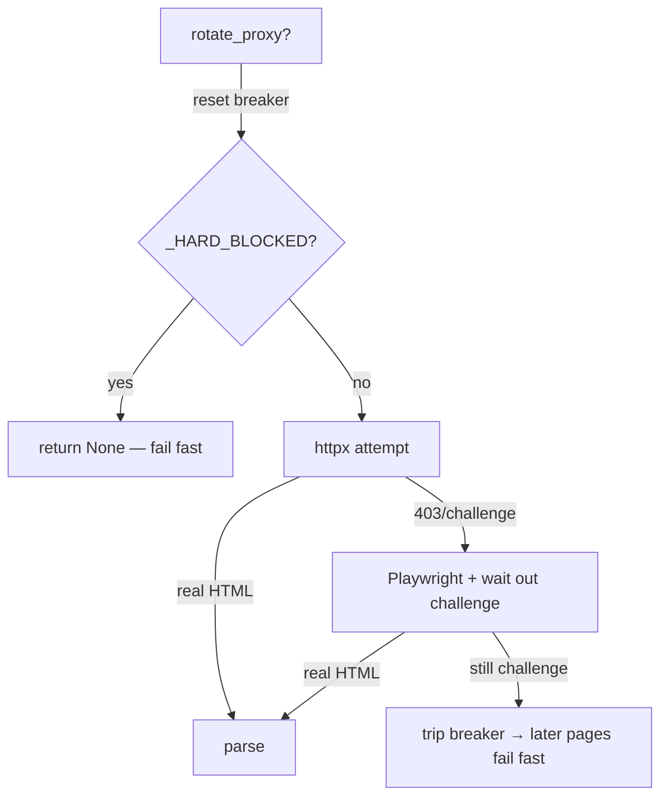

# Hotfrog

> [!info] Legacy directory behind Cloudflare
> Parent: [[Scraper System]] · Role: [[Discovery vs Enrichment|discovery]] · Runs once per job via [[Sources Orchestrator]]

Hotfrog sits behind a Cloudflare "Just a moment" JS challenge. `search_businesses()` (`hotfrog_core.py:706`) uses httpx-then-Playwright with a hard-block circuit breaker.

## The fetch strategy

`_fetch_page` (:465) is the orchestrator; `_looks_like_challenge` (:58) rejects a Cloudflare interstitial even when it arrives with a 200.

## The circuit breaker — `_HARD_BLOCKED`

> [!warning] Why fail-fast matters here
> Once Cloudflare hard-blocks the current IP, **every** further page will too, and the browser can't solve it — so grinding each page wastes ~40-60s. The breaker (:37) stops hitting Hotfrog for the rest of the process. It trips **only** after BOTH httpx and the browser fail (`:_fetch_page`), and `reset_block_state()` (:40) clears it on a fresh IP.

Tested in `tests/test_hotfrog_breaker.py` (breaker trips only when browser also fails; httpx-403 still falls through to the browser).

## Challenge handling — waiting, not clicking

`_solve_challenge` (:386) **waits** for Cloudflare's managed challenge to auto-resolve (poll title, 2s × 8 = 16s ceiling), then gives up. It used to also click the Turnstile iframe / ALTCHA / "verify" buttons — removed, because Turnstile isn't reliably click-solvable and it mostly burned wall-clock → [[Scraper Roadmap and YAGNI#Fixed]]. `_CHALLENGE_TITLES` (:382) is the shared fingerprint list.

## Parsing

JSON-LD first (`_iter_jsonld` :129, handles `@graph`), CSS-card fallback (`_parse_businesses` :520). `_norm_business` (:175) carefully separates the **Hotfrog profile URL** from the business's real website (`sameAs` vs `url` precedence). `_parse_pagination` (:254) extracts only `total_pages` — the one field [[Sources Orchestrator|the caller]] uses to stop the crawl.

> [!quote] Warm session > rotating IPs
> The [[Sources Orchestrator|`_gather_hotfrog`]] loop keeps ONE session and only rotates the IP **after** a block — a fresh IP per page re-triggers the JS challenge every time and reads as bot traffic.

#scraper/concept #scraper/hotfrog
