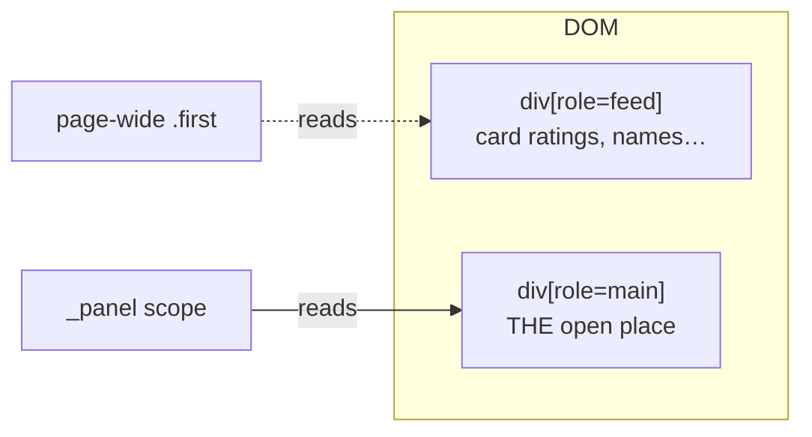

# Maps Extraction Internals

> [!important] The correctness core
> Parent: [[Scraper System]] · Shared by [[Google Maps Discovery]] **and** [[Google Maps Enrichment]] · The single reader that knows how to pull a Maps place correctly.

Reading Google Maps is easy to get *subtly wrong* — the wrong number extracted looks exactly like the right one. Three techniques make `_extract_detail` (`google_maps_search.py:232`) trustworthy.

## 1. Panel scoping — read the OPEN place, not a neighbour

> [!danger] The bug this prevents
> After you open a place, the **results feed stays in the DOM**. Feed cards also contain ratings (`span.MW4etd`), addresses, names. A page-wide `page.locator("span.MW4etd").first` grabs the **first feed card's** rating, not the place you opened.

`_panel()` (:216) scopes every read to `div[role='main']:has(h1.DUwDvf)` — the open detail container — so extraction can never bleed in a neighbouring card's data.

## 2. `data-item-id` over CSS classes

`_extract_data_items` (:126) reads address / phone / website / plus-code from Google's **semantic** rows — `button[data-item-id='address']`, `[data-item-id^='phone']`, `[data-item-id='authority']`, `[data-item-id='oloc']`. These are stable; the cosmetic class names (`DUwDvf`, `F7nice`, `Io6YTe`) rotate. Classes are only a fallback.

## 3. Navigate, don't click

> [!warning] Clicking leaves stale panel state
> Clicking result N, then result N+1, can leave the previous panel's DOM half-present → corrupted extraction. **Navigating** to each `/maps/place/…` URL guarantees a fresh, fully-loaded panel every time.

Discovery collects URLs then `page.goto`s each (`google_maps_search.py:471`). Enrichment does the same for the one matched place → [[Google Maps Enrichment]].

## Supporting helpers

| Helper | Line | Job |
|--------|------|-----|
| `_text_from` | :94 | first selector that matches AND has text |
| `_parse_rating` / `_parse_reviews` | :192 / :204 | tolerant number parsing (`4.6\n(1,580)`) |
| `_parse_latlng` | :108 | lat/lng from `@lat,lng` or `!3d!4d` URL forms |
| `_extract_hours` | :178 | open/closed via aria-label |
| `_wait_for_feed` | :517 | feed vs single-place disambiguation |
| `_maybe_accept_consent` | :537 | dismiss Google's cookie wall |

> [!tip] Why one reader, two callers
> [[Google Maps Enrichment]] used to have its **own** extractor that was page-scoped and class-first — it could attach a wrong business's rating. It now calls `_extract_detail`, so both paths inherit all three techniques above. See [[Scraper Roadmap and YAGNI#Fixed]].

#scraper/concept #scraper/google-maps #scraper/correctness
