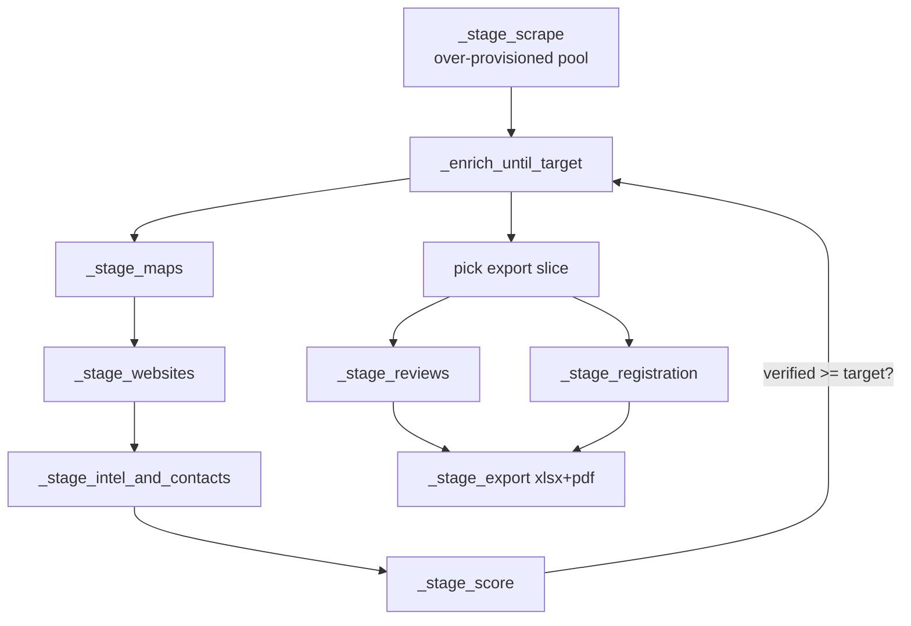

# Pipeline Integration

> [!info] How scrapers become delivered leads
> Parent: [[Scraper System]] · Gate logic: [[Accuracy and Verification]]

`run_pipeline()` (`pipeline.py:132`) is the Celery task. The scrapers feed stage 1; enrichment stages run **best-first until the verified target is met**, not over the whole pool.

## The stages

| Stage | Line | Uses |
|-------|------|------|
| `_stage_scrape` | :294 | [[Sources Orchestrator|`gather_leads_tiled`]] → candidate pool |
| `_enrich_until_target` | :374 | batch loop, stops at N verified |
| `_stage_maps` | :421 | [[Google Maps Enrichment]] (skips leads already on Maps / NPI+phone) |
| `_stage_score` | :542 | the weighted rubric → `lead_score` + `data_confidence` |
| `_stage_reviews` | :812 | [[Review Scraper]] (export slice only) |
| `_stage_export` | :897 | xlsx + pdf + manifest |

## Pool sizing — over-provision then converge

> [!tip] `limit` = verified leads, not scraped rows
> `pool_target = min(limit × POOL_FACTOR, POOL_MAX)`. The pool is intentionally bigger than the target so `_enrich_until_target` can keep enriching best-first candidates until enough clear the [[Accuracy and Verification|verified bar]] — see [[Scraper Configuration#Pool sizing]].

## Enrich until target

Candidates arrive **ranked** ([[Sources Orchestrator|`_verify_likelihood`]]). Each batch runs the full chain (Maps → website → intel+contacts → score); after each, `verified = sum(_is_verified)`. Stop at `verified >= target` or pool exhausted. Only the winners pay the per-lead cost.

## Cross-run dedup

`_load_delivered_exclude` (:253) builds a predicate excluding any business **already delivered** (verified) in a prior job — global across niches, matched on phone last-7 or normalised name — so the same business is never handed over twice.

## Deep-depth stages

`_stage_reviews` (:812) and `_stage_registration` (:857) run **only on the export slice** (cost control) and **soft-fail** — a blocked review scan never fails the job.

#scraper/reference #scraper/pipeline
