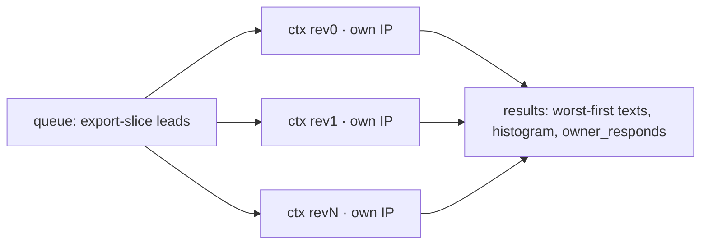

# Review Scraper

> [!info] Real review content, not rating arithmetic
> Parent: [[Scraper System]] · Role: [[Discovery vs Enrichment|enrichment]] · Gated off (`ENABLE_REVIEW_SCRAPE`)

The pitch wedge for a reputation-management angle needs **evidence**: the worst reviews' text, the true last-review date, the 1★…5★ histogram, and whether the owner replies to negatives — not inference over rating+count.

## Two halves — pure vs live

> [!tip] Testable logic, forgiving DOM
> The parsing/summarising is separated from the Playwright harvest so the logic is unit-tested while the live selectors stay best-effort and never raise into the pipeline.

| Pure helper | Line | Job | Tested |
|-------------|------|-----|:--:|
| `parse_stars` | :35 | aria-label → 1-5 | ✅ |
| `summarize_review_weaknesses` | :49 | reviews+histogram → weakness text + count | ✅ |
| `build_theme_input` | :77 | the ≤N worst texts for the LLM | ✅ |

`harvest_reviews` (:100) is the live half: click the Reviews tab, sort **lowest-first** (surfaces the weakness signal), harvest cards with defensive multi-selectors. Soft-fails to whatever it got.

## Concurrency (the fix)

`_scrape_reviews_batch` (:175) now runs **N contexts on per-context Tor circuits** over a shared queue — same pattern as [[Google Maps Enrichment]]. It was sequential + direct (one IP, ~1 lead/5s), a scaling cliff once the export slice grew.

`n_ctx` scales to [[Circuit Capacity and Concurrency|circuit capacity]].

## Cost control

Runs **only on the export slice** (≤ `limit` leads with a Maps URL + reviews), never the whole candidate pool — wired in [[Pipeline Integration#Deep-depth stages|`_stage_reviews`]]. Feeds `review_weaknesses` (a scoring **penalty**) and `review_lowest_texts`.

> [!caution] Known soft edge
> After the lowest-first sort, `last_review_date` is a proxy (it takes the first shown card's date, now the lowest-rated not the newest). Acknowledged in-code; the weakness signal is the real deliverable.

#scraper/concept #scraper/reviews
