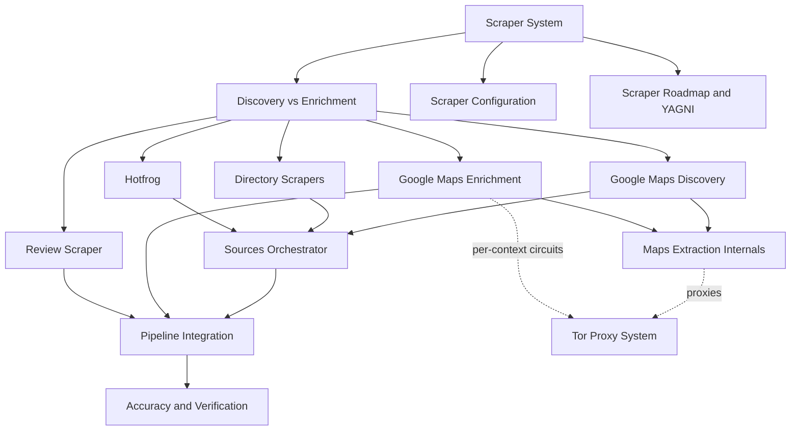

# Scraper System — Map of Content

> [!abstract] One-sentence mental model
> **Discover** a large over-provisioned pool of businesses from many sources, **merge & dedup** them into unique leads, then **enrich until N are verified** — each stage isolated so a blocked source never sinks the job.

This is the acquisition half of the lead pipeline. The other half (proxies) lives in [[Tor Proxy System]] — the scrapers are its biggest consumer.

## The concept graph

## Read order

1. [[Discovery vs Enrichment]] — the two roles every scraper falls into
2. [[Google Maps Discovery]] — the primary source (volume + depth)
3. [[Maps Extraction Internals]] — **the correctness core** (panel scoping, `data-item-id`, navigate-not-click)
4. [[Google Maps Enrichment]] — confirming a known business (now delegates to the discovery reader)
5. [[Sources Orchestrator]] — tiling, cross-source merge & dedup
6. [[Directory Scrapers]] · [[Hotfrog]] · [[Review Scraper]] — the supplementary sources
7. [[Pipeline Integration]] — scrape → enrich-until-target → export
8. [[Accuracy and Verification]] — how a candidate becomes a delivered lead
9. [[Scraper Configuration]] · [[Scraper Roadmap and YAGNI]]

## Source roster

| Source | Role | Transport | State | Note |
|--------|------|-----------|:--:|------|
| Google Maps (search) | discovery ⭐ | Playwright | on | [[Google Maps Discovery]] |
| Google Maps (rating) | enrichment | Playwright | on | [[Google Maps Enrichment]] |
| NPI registry | discovery | API | on | official US medical registry (not a scraper) |
| Hotfrog | discovery | Playwright+httpx | on | [[Hotfrog]] |
| YellowPages | discovery | httpx | gated-off | [[Directory Scrapers]] |
| Yelp | discovery | httpx | gated-off | [[Directory Scrapers]] |
| Reviews | enrichment | Playwright | gated-off | [[Review Scraper]] |
| Registration | enrichment | API | gated-off | legal-entity lookup |

> [!info] Status snapshot (2026-07-07)
> The four analysis findings are fixed → [[Scraper Roadmap and YAGNI]]. 437 unit tests green. The **DOM-dependent** paths still need one live run to confirm against today's Maps markup.

#scraper/moc
