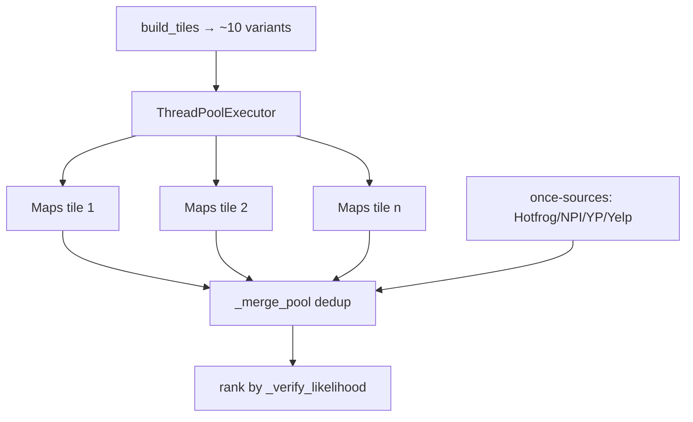

# Sources Orchestrator

> [!info] Many sources → one deduplicated pool
> Parent: [[Scraper System]] · Consumed by [[Pipeline Integration]]

`sources.py` turns "run all the scrapers" into "return up to N unique, ranked businesses." It's what makes the `limit` slider meaningful — pool many sources, dedup across them, keep the richest value per field.

## Tiling — beating one query's ~48-result ceiling

`build_tiles()` (:290) expands one `(niche, location)` into ~10 query variants — geographic (`Downtown/North/South/…`, which re-centre Maps for real spatial diversity) + phrasing (`best/top/… services`). `gather_leads_tiled()` (:376) runs the **Maps** tiles concurrently (`TILE_CONCURRENCY`), merging into a pool, and **stops early** once `candidate_target` is reached.

> [!tip] Once vs per-tile
> Hotfrog paginates deep and NPI sweeps 150+ in one call — re-running them per tile just re-crawls near-identical queries. So they run **once**; only Maps (which re-centres per tile) is tiled. (:426)

## Cross-source merge & dedup

| Piece | Line | Role |
|-------|------|------|
| `_match` | :68 | same business? phone last-7 **or** name-fuzzy ≥88 + address-partial ≥60 |
| `merge_sources` | :139 | seed Maps first, fold each record in, richest value wins |
| `_merge_into` | :95 | per-field conflict resolution via `_FIELD_PRIORITY` |
| `_FIELD_PRIORITY` | :39 | e.g. phone → NPI wins; address/rating → Maps wins |
| `_verify_likelihood` | :358 | rank: multi-source > on-Maps > NPI > has-phone > has-website |

`LEAD_FIELDS` (:25) is the canonical schema every source normalises into; `phone_source_count` records how many independent sources agree on the phone — real corroboration for the [[Accuracy and Verification|confidence score]].

## Ranking = enrich the winners first

The pool is sorted best-first by `_verify_likelihood` so [[Pipeline Integration#Enrich until target|enrich-until-target]] pays the per-lead cost on the candidates most likely to verify, and nameless directory noise sinks to the back.

> [!note] Cross-run dedup
> A business already **delivered** in any prior job is excluded before merging → [[Pipeline Integration#Cross-run dedup]]. Same match keys as the in-run deduper.

#scraper/concept #scraper/orchestration
