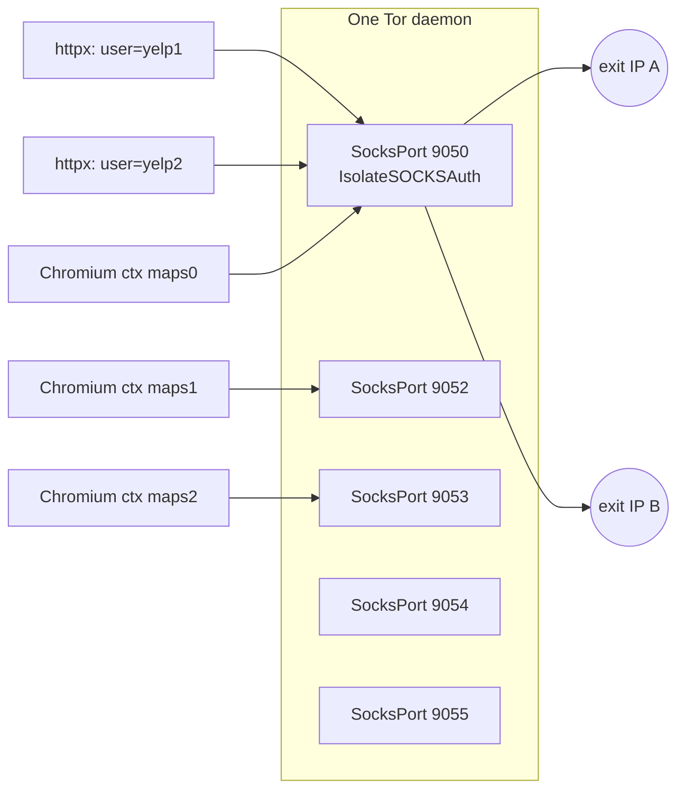

# Circuit Isolation

> [!important] This is the root idea of the whole subsystem
> Parent: [[Tor Proxy System]] · Built on: [[Tor Fundamentals]] · Exposed via: [[get_proxy and Tags]]

## The problem it solves

Old model: **3 separate Tor daemons** on ports 9050/9150/9250 → 3 exit IPs, plus a control port each for `NEWNYM`. Heavy to run, and enrichment still funneled **all** browser contexts through **one** shared circuit → one IP → Google throttled it → forced low concurrency + long sleeps.

New model: **one daemon, many circuits, claimed by key.** Isolation replaces rotation.

## Two isolation strategies, one API

| Client | Can send SOCKS auth? | Isolation strategy | Distinct IPs |
|--------|:--:|--------------------|:--:|
| **httpx** | ✅ | SOCKS **username** on one port (`socks5://tag:x@host:9050`) | ~unlimited |
| **Playwright / Chromium** | ❌ | different **SocksPort** per worker | = #ports |

Both are reached through the **same** call — `get_proxy(for_playwright=?, tag=?)` — which picks the right strategy internally. See [[get_proxy and Tags]].

> [!danger] The gotcha that shapes everything
> **Chromium silently ignores SOCKS5 auth.** If you passed `username`/`password` to a Playwright SOCKS proxy expecting per-context IPs, every context would still share **one** circuit and you'd never notice — until Google blocked you. That's why Chromium *must* isolate by port. Documented in [[Tor Fundamentals#The Chromium caveat drives the whole design]].

## How a "tag" becomes a circuit

A **tag** is just an isolation key chosen by the caller (e.g. `maps0`, `yelp1247`).

- **httpx path** → `TorInstance.isolated_httpx_dict(tag)` builds `socks5://{tag}:x@host:port`. Tor's `IsolateSOCKSAuth` maps each distinct `tag` to its own circuit. See [[TorInstance]].
- **Playwright path** → `hash(tag) % len(healthy_ports)` selects a port; the returned `{"server": "socks5://host:PORT"}` carries **no** auth. Different tags fan across ports.

Same tag → same circuit (stable, thanks to [[Tor Fundamentals#MaxCircuitDirtiness]]). Different tag → (very likely) different circuit.

## Graceful degradation (why it's low-risk)

If only **one** SOCKS port is alive (un-migrated deployment), `hash(tag) % 1 == 0` for every tag → all Playwright workers map to that one port → behavior is **identical to before**. No regression; extra ports simply *unlock* more IPs. Proven by `test_proxy_rotator.py::TestCircuitIsolation::test_playwright_tags_spread_across_ports` and the single-port smoke.

## Rotation is now a fallback, not the mechanism

Because a fresh key already gives a fresh circuit, `NEWNYM` rotation is demoted to a belt-and-suspenders path in `report_block()`. The retry loop in [[Failure Classification and Retry]] gets its "new IP" simply by asking for a new tag.

## Related
- [[Circuit Capacity and Concurrency]] — how many distinct circuits you actually have, and sizing to it.
- [[Tor Daemon Deployment]] — the `torrc` that opens the extra `SocksPort`s.

#tor-proxy/concept #tor-proxy/core
