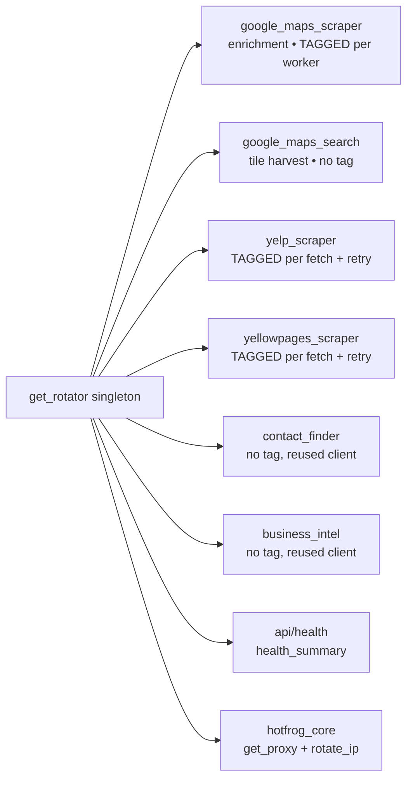

# Consumers — who calls the rotator

> [!info] Every call site of [[ProxyRotator]]
> Parent: [[Tor Proxy System]] · API: [[get_proxy and Tags]]

## Map

## Table

| Consumer | File:line | Mode | Tag? | Notes |
|----------|-----------|------|:--:|-------|
| **Maps enrichment** | `google_maps_scraper.py:455,463` | Playwright | ✅ `maps{w}` | per-context circuit; sizes to `circuit_capacity()` → [[Circuit Capacity and Concurrency]] |
| **Maps tile search** | `google_maps_search.py:394` | Playwright | ❌ | launch-time proxy; round-robin spreads tiles across ports |
| **Yelp** | `yelp_scraper.py:44` | httpx | ✅ `yelp{n}` | fresh circuit per fetch → [[Failure Classification and Retry]] |
| **YellowPages** | `yellowpages_scraper.py:40` | httpx | ✅ `yp{n}` | same pattern; interstitial detection |
| **Contact finder** | `contact_finder.py:398` | httpx | ❌ | business sites; one reused client (keep-alive) |
| **Business intel** | `business_intel.py:136` | httpx | ❌ | reused client + `retry_sync` |
| **Health endpoint** | `api/health.py:37` | — | — | `health_summary()` (fast, cached) → [[Health and Thread-Safety]] |
| **Hotfrog (legacy)** | `hotfrog_core.py:443,454` | both | ❌ | uses `get_proxy` + `rotate_ip(force_new=False)`; per-page fetch already gets fresh circuits |

> [!note] Why some consumers pass no tag
> - **Tile search** launches one browser per tile in its own thread → each already calls `get_proxy` independently; round-robin gives them different ports for free.
> - **contact_finder / business_intel** hit *business websites* (not aggressive blockers) and reuse a single httpx client for connection keep-alive. Circuit-freshness buys little there, so they were left simple on purpose ([[Roadmap and YAGNI]]).

## The per-context wiring (enrichment)

> [!tip] Chromium per-context proxy needs a launch sentinel
> The browser launches with `proxy={"server": "per-context"}` (a Playwright sentinel that enables Chromium's proxy path), then **each context** sets its real circuit via `_worker_proxy(w)` → `get_proxy(for_playwright=True, tag=f"maps{w}")`. Without the sentinel, Chromium wouldn't honour per-context proxies. See [[Circuit Isolation]].

#tor-proxy/reference
