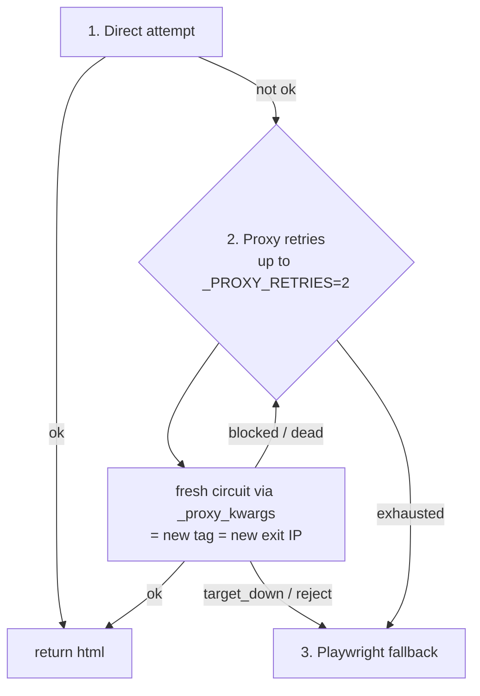

# Failure Classification and Retry

> [!info] Phase 2 — react to the *cause*, retry on a fresh circuit
> Parent: [[Tor Proxy System]] · Uses: [[get_proxy and Tags]] · Tested: `tests/test_scraper_retry.py`

## The idea

A blocked request and a dead circuit both "fail," but they need **opposite** responses. Classifying the outcome lets the loop know whether a **new exit IP** can help.

## The four buckets (`_classify`)

| Outcome | Trigger | Can a fresh IP help? | Action |
|---------|---------|:--:|--------|
| `ok` | 2xx + real body | — | return |
| `blocked` | 403/429, or thin/interstitial body | ✅ yes | **retry on fresh circuit** |
| `dead` | timeout / connect / proxy / reset | ✅ yes | **retry on fresh circuit** |
| `target_down` | 5xx | ❌ no | **bail fast** |
| `reject` | 404/410 | ❌ no | **bail fast** |

> [!note] YellowPages nuance
> YP serves a short **interstitial** (not a 403) when it blocks, so `_classify` there treats `status < 400 AND len(body) ≤ 2000` as `blocked`. Yelp uses its `_is_blocked()` captcha detector instead.

## The retry loop (Yelp / YellowPages `_fetch`)

> [!tip] Why the retry is nearly free
> Each `_proxy_kwargs()` call mints a **fresh tag** (`yelp{counter}`), and a fresh tag is a fresh circuit ([[Circuit Isolation]]). So "retry on a new IP" costs one counter increment — no `NEWNYM`, no sleep.

## Direct-first is deliberate

Directories **blocklist Tor exit IPs**, so a clean direct IP is tried **first**; Tor is the *fallback*, and a real browser is the last resort. Don't "fix" this to proxy-first. (Consistent with [[Proxy Strategy Tiers]].)

## What this superseded
Phase 1 wired a one-shot `report_block()` that rotated but never actually **retried** through the fresh circuit. This loop replaces it — the `_report_block` helpers were removed.

## Scoped out (YAGNI)
- **Per-tag EWMA scoring** — tags are single-use; the 5 ports share one daemon's guards → almost no per-port signal. Real variance is per-exit-circuit and ephemeral. See [[Roadmap and YAGNI#Deliberately not built]].
- **`contact_finder` / `business_intel`** retry-on-circuit — they hit business sites (not blockers) and already have `retry_sync`. See [[Consumers]].

#tor-proxy/concept #tor-proxy/phase-2
