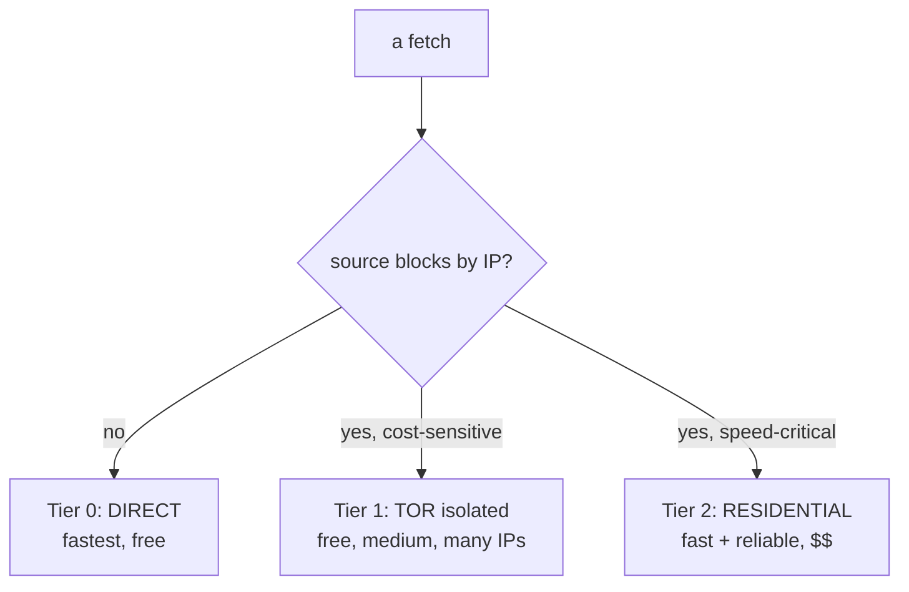

# Proxy Strategy Tiers

> [!info] The honest speed ceiling — and how to break it
> Parent: [[Tor Proxy System]] · Related: [[Circuit Isolation]], [[Failure Classification and Retry]]

## Tor is free but structurally slow

Three encrypted hops → ~0.5–2 Mbit, higher latency, and exit IPs that are **widely blocklisted** by anti-bot vendors. No amount of tuning beats the physics ([[Tor Fundamentals#Why Tor is free but slow]]). Isolation makes Tor as *concurrent* as possible; it can't make a single request *fast*.

## The three tiers

| Tier | Use for | Speed | Cost | Wired? |
|------|---------|-------|------|:--:|
| **Direct** | sources that don't block by IP | fastest | free | ✅ (direct-first in [[Consumers]]) |
| **Tor (isolated)** | Maps volume, cost-sensitive | medium | free | ✅ [[Circuit Isolation]] |
| **Residential** | the hard blockers (Yelp/YP), speed runs | fast | 💲 | ✅ *plumbed*, unpopulated |

## Tier 2 is already plumbed

> [!tip] `EXTERNAL_SOCKS_PROXIES` is the switch
> Populate `EXTERNAL_SOCKS_PROXIES` ([[Configuration]]) and `get_proxy()` routes through those real proxies **before** Tor — `circuit_capacity()` even counts them. No code change needed; it's a business/$$ decision, not an engineering one. This is **Phase 4** in [[Roadmap and YAGNI]].

## Direct-first is a feature, not a bug

Directories blocklist Tor exits, so trying the **clean direct IP first** is both faster and less blocked; Tor is the fallback. Enshrined in the Yelp/YP retry loop — see [[Failure Classification and Retry#Direct-first is deliberate]].

## Decision rule of thumb

- Free + tolerant source → **Direct**.
- Free-but-blocking, cost matters → **Tor isolated** (this subsystem).
- Blocking + you need it fast/reliable and can pay → **Residential** via Tier 2.

#tor-proxy/concept #tor-proxy/strategy
