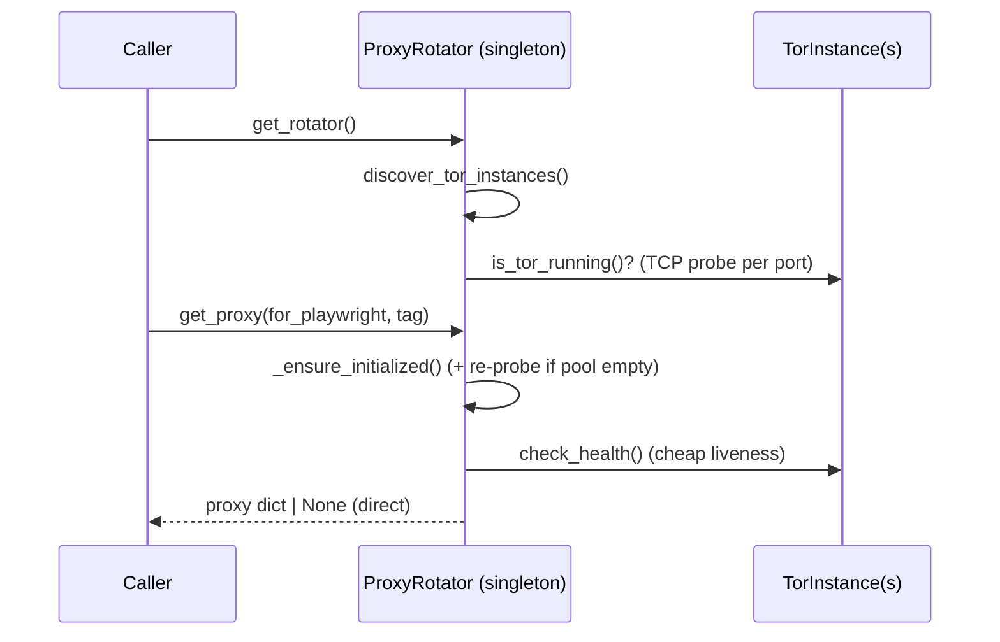

# ProxyRotator

> [!info] The pool owner
> `backend/services/proxy_rotator.py` · Parent: [[Tor Proxy System]] · Manages: [[TorInstance]] · API: [[get_proxy and Tags]]

A process-wide **singleton** that discovers Tor SOCKS ports, tracks their health, and hands out proxies. Accessed via `get_rotator()`; reset via `reset_rotator()` (tests/reconfig).

## Lifecycle

## State (`__init__`, line ~207)

| Field | Purpose |
|-------|---------|
| `_instances` | list of [[TorInstance]] (one per SOCKS port) |
| `_external_proxies` | optional real SOCKS proxies (residential tier) |
| `_current_index` | round-robin cursor (no-tag path) |
| `_lock` | `threading.Lock` — see [[Health and Thread-Safety]] |
| `_request_count` | drives `IP_ROTATE_EVERY_N_REQUESTS` |
| `_last_rotation` | cooldown gate for `rotate_ip` |
| `_cooldown`, `_rotate_every_n` | from [[Configuration]] |

## Method index

| Method | Line | Role |
|--------|:--:|------|
| `discover_tor_instances()` | 224 | probe ports → build `_instances`; sets `_last_discover` |
| `_ensure_initialized()` | 266 | lazy init + **re-probe** when pool empty (>30 s) |
| `get_proxy(for_playwright, tag)` | 277 | **main API** → [[get_proxy and Tags]] |
| `_isolated_proxy(for_playwright, tag)` | 335 | per-tag circuit selection ([[Circuit Isolation]]) |
| `circuit_capacity()` | 444 | distinct exit IPs available → [[Circuit Capacity and Concurrency]] |
| `rotate_ip(force_new)` | 386 | cooldown-gated NEWNYM / index bump |
| `report_block()` | 457 | "this IP is burned" → `rotate_ip` |
| `check_health` via instances | — | [[Health and Thread-Safety]] |
| `health_summary()` | 475 | fast, cached — `/health` endpoint |
| `get_all_ips()` | 464 | **slow**, verifies each exit IP (network) |

## `rotate_ip` and `report_block`

> [!note] Cooldown-gated, network done outside the lock
> `rotate_ip()` (line 386) first checks `now - _last_rotation < _cooldown` under the lock and bails if too soon; only the winner proceeds to `NEWNYM` (which sleeps for the circuit to settle). Concurrent callers that lose the race just skip — the winner's fresh circuit serves everyone. `report_block()` is a thin, self-documenting alias used by scrapers.

With [[Circuit Isolation]] in place these are a **fallback**: fresh tags already yield fresh circuits, so the retry loop rarely needs `NEWNYM`.

## Singleton helpers (module bottom)
- `_build_config_from_settings()` (501) — reads [[Configuration]] into the pool config.
- `get_rotator(config=None)` (525) — build-once accessor.
- `reset_rotator()` (535) — drop the singleton.

## Consumers
Every call site is catalogued in [[Consumers]].

#tor-proxy/class
