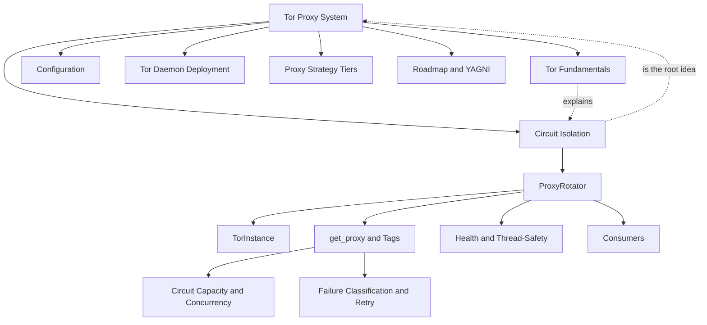

# 🧅 Tor Proxy System — Map of Content

> [!abstract] What this is
> The lead-generator scrapes Google Maps, Yelp, YellowPages and Hotfrog. Those
> sites rate-limit and block by **exit IP**. This subsystem hands each concurrent
> worker its **own Tor exit IP** so scraping runs **fast** (real concurrency) and
> **reliably** (no single IP gets throttled), from **one** Tor daemon.

The whole system is one file — [[ProxyRotator]] in `backend/services/proxy_rotator.py` — plus its consumers and the Tor daemon it talks to.

## 🗺️ The concept graph

## 📚 Read in this order

1. [[Tor Fundamentals]] — circuits, exit IPs, `IsolateSOCKSAuth`, `SocksPort`, `NEWNYM`. The Tor facts everything else exploits.
2. [[Circuit Isolation]] — **the root idea**: one daemon → many exit IPs, via two different tricks for httpx vs Chromium.
3. [[ProxyRotator]] — the singleton that owns the pool and hands out proxies.
4. [[TorInstance]] — one SOCKS port as a health-tracked unit.
5. [[get_proxy and Tags]] — the API surface; how a caller claims its own circuit.
6. [[Circuit Capacity and Concurrency]] — sizing worker parallelism to real IP diversity + the per-IP-rate math.
7. [[Failure Classification and Retry]] — reacting to the *cause* of a failure, retrying on fresh circuits.
8. [[Health and Thread-Safety]] — the cheap hot path vs the expensive verification path; locking.
9. [[Consumers]] — every call site and how it uses the rotator.
10. [[Configuration]] — the knobs.
11. [[Tor Daemon Deployment]] — the `torrc`, the launch script, docker-compose.
12. [[Proxy Strategy Tiers]] — direct / Tor / residential, and the honest speed ceiling.
13. [[Roadmap and YAGNI]] — the four phases, what shipped, what was deliberately not built.

## 🧭 The one-sentence mental model

> [!tip] Core insight
> A Tor **circuit** = an **exit IP**. You get a distinct circuit per **SOCKS username** *and* per **SOCKS port**. So a single daemon serves unlimited concurrent exit IPs — you never "rotate," you just **use a different key**. See [[Circuit Isolation]].

## 🚦 Status snapshot

| Phase | Concept | State |
|------|---------|-------|
| 1 | [[Circuit Isolation]] — per-worker IPs | ✅ shipped |
| 2 | [[Failure Classification and Retry]] | ✅ shipped |
| 3 | [[Circuit Capacity and Concurrency]] | ✅ shipped |
| 4 | [[Proxy Strategy Tiers]] — residential tier | 🔲 optional / $$ |

Validation: 439 unit tests green; **live** exit-IP distinctness + block-rate still need a real Tor run — see [[Tor Daemon Deployment#Live validation]].

#tor-proxy/moc
