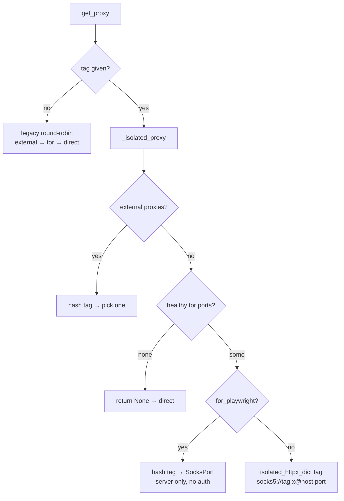

# `get_proxy()` and Tags

> [!info] The one API surface
> `ProxyRotator.get_proxy(for_playwright=True, tag=None)` (line 277) · Parent: [[ProxyRotator]] · Implements: [[Circuit Isolation]]

```python
get_proxy(for_playwright: bool = True, tag: str | None = None) -> dict | None
```

Returns a proxy dict, or **`None` = connect directly** (no Tor available).

## The two parameters

### `for_playwright`
Picks the **return shape**:
- `True` → `{"server": "socks5://host:port", ...}` (Playwright/Chromium)
- `False` → `{"all://": url, "http://": url, "https://": url}` (httpx)

### `tag` — the isolation key (the important one)
| `tag` value | Behavior |
|-------------|----------|
| `None` | **legacy** round-robin over the pool; byte-for-byte the old contract (locked by tests) |
| a string | **isolated circuit** for this key → [[Circuit Isolation]] |

> [!tip] The tag contract
> - A caller that owns a **long-lived worker** (a browser context, an enrichment slot) passes a **stable** tag (`maps0`, `maps1`, …) so that worker keeps its own exit IP.
> - A caller that wants a **fresh IP every request** passes a **changing** tag (`yelp{counter}`) — see [[Failure Classification and Retry]].
> - Two different tags → two circuits/IPs. Same tag → one circuit (stable ~10 min, [[Tor Fundamentals#MaxCircuitDirtiness]]).

## Decision flow



## Auto-features baked into `get_proxy`
- **Auto-rotate every N**: honours `IP_ROTATE_EVERY_N_REQUESTS` (0 = off) by counting hand-outs and calling `rotate_ip` — see [[Configuration]].
- **Thread-safe**: index/counter mutations are under `_lock` — see [[Health and Thread-Safety]].
- **Re-probe**: `_ensure_initialized()` re-discovers Tor if the pool is empty and >30 s passed.

## Worked examples

```python
r = get_rotator()

# Enrichment worker 3 → its own stable Chromium circuit (a SocksPort)
ctx_proxy = r.get_proxy(for_playwright=True, tag="maps3")

# A Yelp fetch → a fresh httpx circuit each call
pk = r.get_proxy(for_playwright=False, tag=f"yelp{next(counter)}")

# Legacy tile search → round-robin, no tag
p = r.get_proxy(for_playwright=True)
```

Callers in [[Consumers]].

#tor-proxy/api
